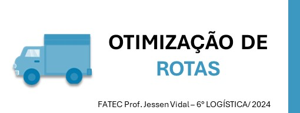
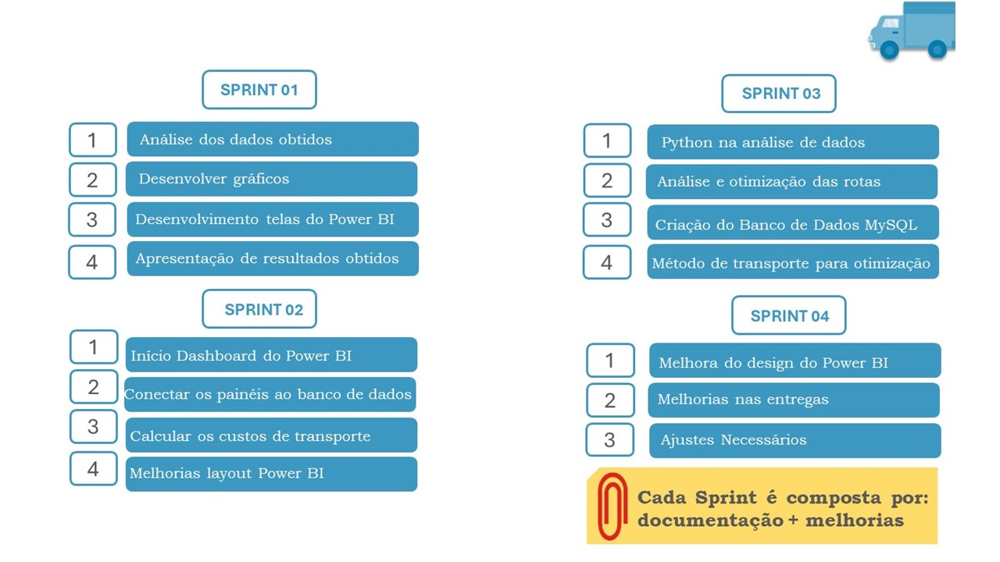
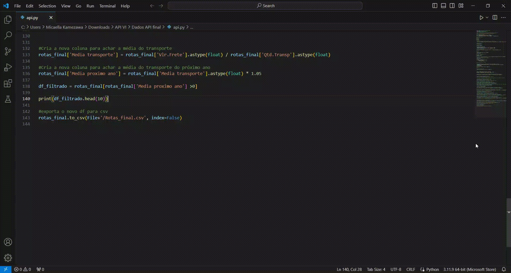
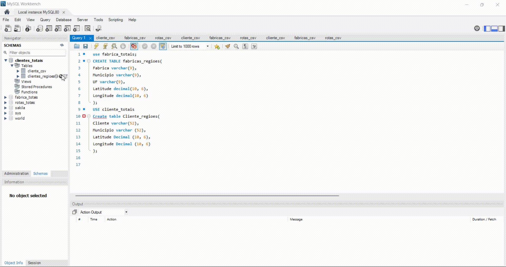
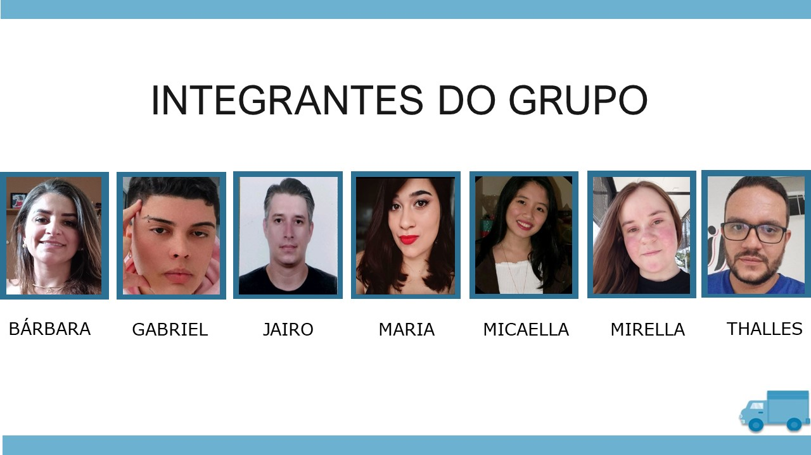

    <a href="#sobre">Sobre</a>  &nbsp |&nbsp &nbsp  
    <a href="#entregas">Entregas</a>  &nbsp |&nbsp &nbsp  
    <a href="#backlogs">Backlogs, Épicos & User Stories</a> &nbsp |&nbsp &nbsp  
    <a href="Planejamento">Planejamento das Sprint</a>
    <a href="#tecnologias">Tecnologias</a>  &nbsp |&nbsp &nbsp 
    <a href="#hard skill">Hard Skill</a>  &nbsp |&nbsp &nbsp 
    <a href="#equipe">Equipe</a>

 
   

## :bookmark_tabs: Sobre o projeto

A partir da apresentação do desafio apresentado pelo cliente, será desenvolvido uma modelagem de banco de dados em SQL, dashboard no Power Bi demostrando aplicação do método de transportes e otimização.

> _Projeto baseado na metodologia ágil SCRUM, procurando desenvolver a Proatividade, Autonomia, Colaboração e Entrega de Resultados dos estudantes envolvidos._

:pushpin: Status do Projeto: **Em Andamento** ⏰

→ [Voltar ao topo](#topo)

 

## 🏁 Entregas de Sprints

Cada entrega foi realizada mediante a criação de uma tag em cada repositório, juntamente com a abertura de uma branch nesses repositórios contendo um relatório abrangente de todos os desenvolvimentos realizados naquela sprint. Veja a relação a seguir:

| Sprint | Previsão de Entrega     | Status | Relatório |
|:------:|:-----------------------:|:------:|:---------:|
| 1 | 17/04/2024 | Concluída  ✅   | [Baixar Arquivo](./assets/Otimizacao_de_Rotas.docx) |
| 2 | 08/05/2024 | Concluída  ✅   | -- |
| 3 | 29/05/2024 | Não Iniciado    | -- |
| 4 | 19/06/2024 | Não Iniciado    | -- |

→ [Voltar ao topo](#topo)

 

## :dart: Backlogs, Épicos &

## Demonstração das Sprints

  
Sprint 1

|Item | Planejamento | Status|
|:---:|:-----------------------------------------:|:----:|
|  1  |Definição das users stories                |  ✅  |
|  2  |Implementação do projeto no GitHub         |  ✅  |
|  3  |Implementação  no Jira Software            |  ✅  |
|  4  |Inicio da análise dos dados obtidos        |  ✅  |
|  5  |Desenvolvimento das telas do Power Bi      |  ✅  |
|  6  |Inicio do relatório técnico                |  ✅  |

- Trabalhos realizados:

- Execução do código Python:

 

  
Sprint 2

|Item | Planejamento | Status|
|:---:|:----------------------------------------------:|:----:|
|  1  |Atualização do projeto no GitHub                 |✅ |
|  2  |Atualização no Jita Software                     |✅ |
|  3  |Inicio dos painéis do banco de dados             |✅ |
|  4  |Desenvolvimento Dashboard das telas do Power Bi  |✅ |
|  5  |Desenvolvimeto da tela inicial do Power Bi       |✅ |
|  6  |Inicio do desenvolvimento da otimização          |✅ |
|  7  |Atualização do relatório técnico                 |✅ |

 

- Execução do código Python:

  

- Execução do SQL

  

- Desenvolvimento do Power bi

  
Sprint 3

|Item | Planejamento | Status|
|:---:|:----------------------------------------------:|:----:|
|  1  |Atualização do projeto no GitHub                 |❌ |
|  2  |Atualização no Jira Software                     |❌ |
|  3  |Criar o banco de dados em SQL                    |❌ |
|  4  |Atualização no Power Bi                          |❌ |
|  5  |Inicio das analise em Python                     |❌ |
|  6  |Atualização do relatório técnico                 |❌ |

 

  
Sprint 4

|Item | Planejamento | Status|
|:---:|:----------------------------------------------:|:----:|
|  1  |Finalização do projeto no GitHub                 |❌ |
|  2  |Finalização no Jira Software                     |❌ |
|  3  |Ajustes necessarios no projeto                   |❌ |
|  4  |Finalização do relatório técnico                 |❌ |

 

→ [Voltar ao topo](#topo)

## Hard Skill

|Tecnologia              | Planejamento     | 
|:----------------------:|:----------------:|
| Jira Software          |⭐⭐⭐⭐⭐     |
| GitHub                 |⭐⭐⭐⭐⭐⭐⭐|
| Python                 |⭐⭐⭐⭐⭐     |
| SQL                    |⭐⭐⭐⭐       |
| Power bi               |⭐⭐⭐⭐⭐     |

## 🛠️ Tecnologias

As seguintes ferramentas, linguagens, bibliotecas e tecnologias foram usadas na construção do projeto:

→ [Voltar ao topo](#topo)

## :busts_in_silhouette: Equipe

|    Função     | Nome                                  | LinkedIn |
| :-----------: | :-----------------------------------: | :------: |
| Product Owner | Barbara Cristina dos Santos Blois     |  |
| Scrum Master  | Maria Paula dos Santos                |  |
|   Dev Team    | Gabriel Ferreira Caillaux dos Santos  |  |
|   Dev Team    | Jairo Corrêa Lanzilote                | |
|   Dev Team    | Micaella Kamezawa                     |  |
|   Dev Team    | Mirella de Fátima dos Reis            |  |
|   Dev Team    | Thalles Bruni Silva Corrêa            |  |

→ [Voltar ao topo](#topo)  

